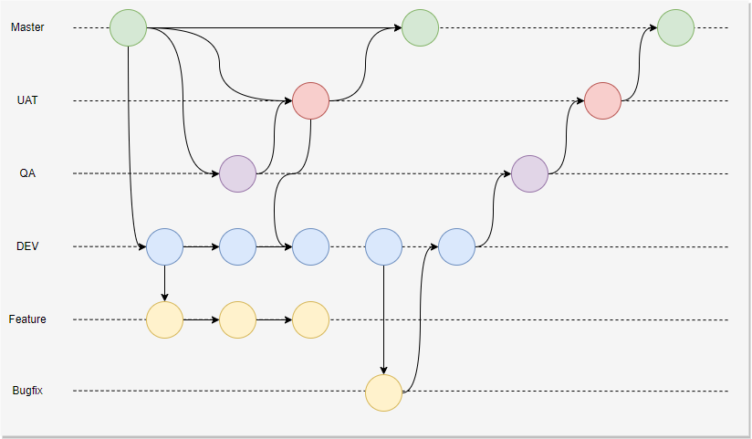

# Microsserviço Playlist

<h3>Olá, somos membros do grupo 25</h3>

<h5>
Esse repositório tem como objetivo descrever um pouco da aplicação a que ele corresponde e indicar as boas práticas de uso dele.
</h5>

<b>Tecnologia:</b>

          

<h3>Objetivo:</h3>
<h5>Aplicação backend para o módulo de playlist</h5>

<h3>Descrição da estrutura da aplicação:</h3>
<h5>Padrão de desenvolvimento DDD com as camadas:
<ul>
    <li>Application</li>
    <li>CrossCutting</li>
    <li>Data</li>
    <li>Domain</li>
    <li>Service</li>
</ul>

<h3>Descrição do padrão de branchs:</h3>
<ul>
    <li>Main - branch principal
    <li>UAT  - branch para testes da equipe de negócios
    <li>QA   - branch para testes da equipe de qualidade
    <li>DEV  - branch para equipe de desenvolvimento realizar testes integrados
    <li>Feature/__nome_da_funcionalidade - branch para desenvolvimento e testes locais de novas funcionalidades
        <li>Feature/__nome_da_funcionalidade - branch para desenvolvimento e testes locais de correção de bugs
</ul>

<h3>Orientações para Pull Request</h3>
<ul>
<li> Criar nova branch a partir da Master
<li> Pull Requests
    <ul>
    <li> branch feature/_nome_da_funcionalidade --> branch Dev
    <li> branch Dev --> branch Qa
    <li> branch Qa  --> branch Uat
    <li> branch uat --> Main
</ul>
